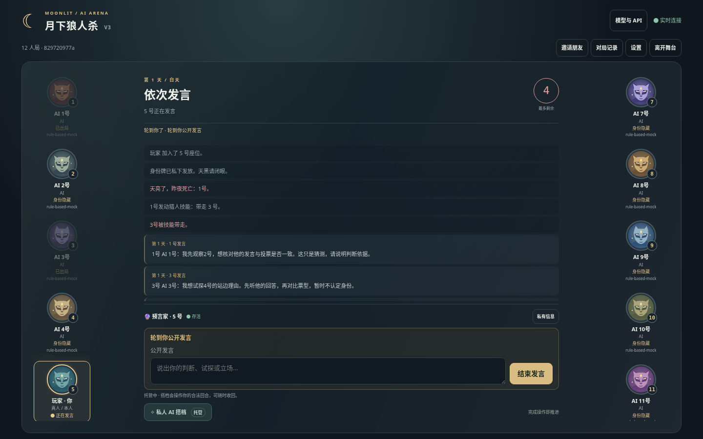

# AI Werewolf · Reproducible Arena V3.1

[中文](README.md) · [License decision pending](LICENSE-DECISION.md) · [Benchmark](docs/benchmark.md)

Multiplayer social deduction with humans and AI, now with reproducible environments and offline research batches. Supports 6/9/12 players and 4–16-player custom rosters, BYOK, dynamic provider/model catalogs, WebSockets, public replay, PWA and local audio/TTS.



```bash
python -m venv .venv
source .venv/bin/activate
# Windows: .venv\Scripts\Activate.ps1
python -m pip install -r requirements.txt
python run.py
```

Open http://localhost:8000. Python 3.12+ is required; deployment and CI use 3.12. Mock works without an API key and is only a practice/engineering fixture. Supported providers: OpenAI, Anthropic, Gemini, DashScope and compatible HTTPS endpoints. Copy `.env.example` for optional provider settings.

```bash
docker build -t ai-werewolf-v3 .
docker run --rm -p 8000:8000 -v werewolf-data:/app/data ai-werewolf-v3
python -m tools.arena run --config experiments/mock.json --games 4 --seed 20261001
# With explicitly configured runtime keys, use --dry-run before a paid experiment:
python -m tools.arena run --config experiments/qwen-vs-openai.json --games 100 --seed 20261001 --dry-run
```

Each experiment outputs an immutable manifest, per-game JSONL, persistent status and JSON/CSV summaries. Reuse the same config/id with `--resume`; add `--retry-failed` only when needed. `/benchmark` imports summary files locally without uploading them. Normal games retain secure randomness; seeds reproduce environment setup/mechanics, not hosted model text. Pairing/rotation reduces assignment bias; intervals remain descriptive because players in a game are correlated.

BYOK is owner/scoped and encrypted; protect `data/` and encryption keys. The server operator can decrypt hosted keys. Use HTTPS and **one** worker; SQLite scheduling is single-process. Public replay remains audience-filtered; private research export requires the original host and a completed game. Traces do not retain keys, sessions, recovery codes or provider hidden reasoning. See [Security](SECURITY.md).

Development: install `requirements-dev.txt`, then run Ruff check/format, Mypy, `coverage run -m unittest discover -s tests -p 'test_*.py'`, `python -m tools.arena.smoke` and `pip-audit -r requirements.txt`. CI also runs browser and Docker smoke. Full commands: [Contributing](CONTRIBUTING.md), [Development](docs/development.md).

Docs: [Reproducibility](docs/reproducibility.md), [Benchmark](docs/benchmark.md), [API V3.1](docs/API-V3.1.md), [Comparison](docs/V3.1-COMPARISON.md), [Acceptance](docs/V3.1-ACCEPTANCE.md), [Changelog](CHANGELOG.md), [Roadmap](ROADMAP.md). Historical V3 evidence is retained under `docs/`.

Project license is **pending the owner's choice**, not automatically MIT/Apache-2.0. Existing Qwen third-party notice remains applicable. See [LICENSE](LICENSE) and [Third-party notices](THIRD-PARTY-NOTICES.md). Resolve licensing/provenance before public publication.
